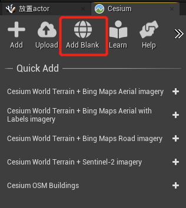
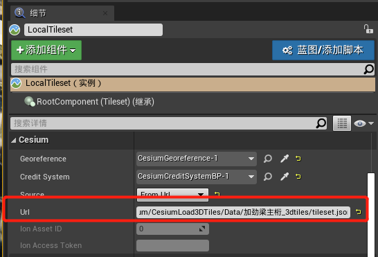
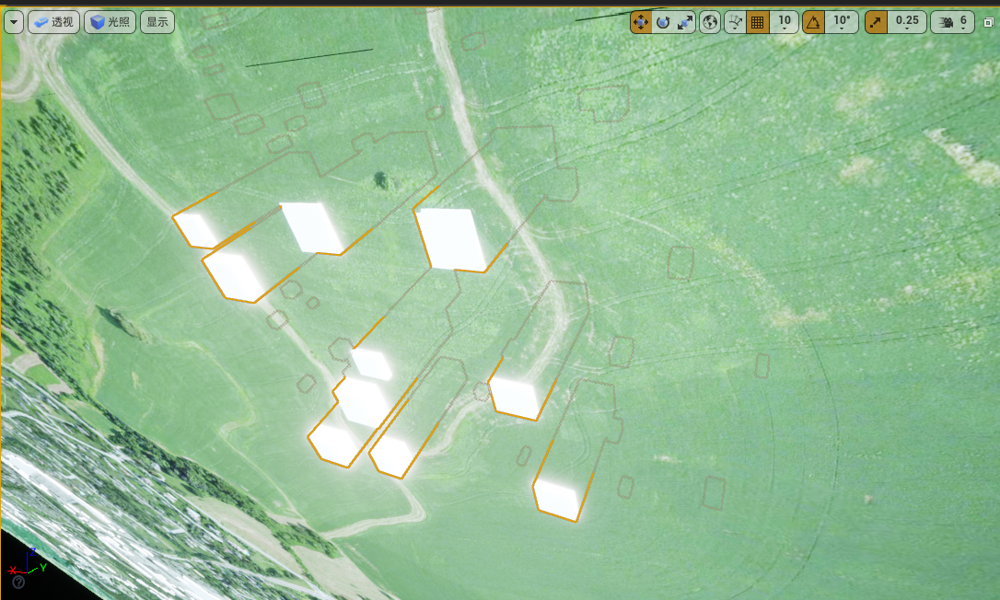
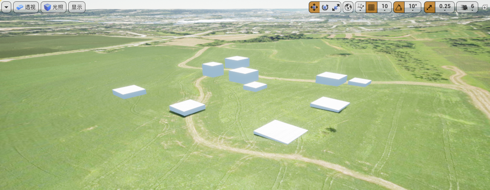

# 本地目录添加3DTileset

注意：以下部分目前仅对Windows计算机上的用户可用。file:///功能在Linux或Mac上不起作用。

在本节中，您将使用一个包含不同高度的盒子的3D Tileset。这个3D Tileset可以在

[这里]: https://cesiumjs.s3.amazonaws.com/downloads/unreal-learning-content/Tileset.zip

下载。一定要下载整个Tileset文件夹，其中包括Tileset.json文件以及所有引用的.b3dm文件。你也可以使用自己的3D Tileset。

注意：如果您是3D Tiles格式的新手，请查看

[3D Tiles Specification]: https://github.com/CesiumGS/3d-tiles

以了解更多信息。

### 1、在编辑器左侧的Cesium UI中，单击Add Blank。这为场景添加了一个新的空白Ceium 3D Tileset。



### 2、在World outline中选择Cesium3D Tileset角色，并将其重命名为“LocalTileset”。

### 3、在细节面板中，寻找Cesium类别。通常，要从Cesium加载数据，您需要填写**Ion Asset ID** 和**Ion Access Token** 字段。为了加载本地数据，您将填充Url字段，而不是3D tiles的主要tilelset.json。在本地目录系统中找到3D Tileset数据。

例如：如果目录为:

```
D:\UE\hxycesium\CesiumLoad3DTiles\Data\Tileset
```

则Url 应该是：

```
file:///D:/UE/hxycesium/CesiumLoad3DTiles/Data/Tileset/tileset.json
```



注意:file:后面有三个前斜杠！

### 4、在大纲视图中，双击LocalTileset角色以在视口中聚焦它。

游戏世界和资产的方向可能不正确，如下所示:



这是因为CesiumGeoreference 的原点距离LocalTileset actor很远。

### 5、视口仍然聚焦于LocalTileset角色，转到World outline，选择CesiumGeoreference角色，并寻找Place Georeference Origin Here按钮。点击这个按钮重新定位世界。




目前，不支持使用Cesium为Unreal加载本地量化网格地形文件。然而，地形资源可以从任何服务器加载，包括本地主机。要完全离线加载地形资源，可以考虑设置一个本地主机来服务于地形。Url字段可以使用与上面相同的步骤来填充

http://localhost:portNumber/terrainAsset

## 资源

[三维瓦片规范]: https://github.com/CesiumGS/3d-tiles
[Cesium]: https://cesium.com/learn/3d-tiling/tiler-data-formats/


