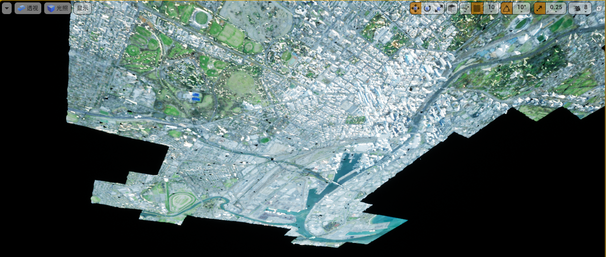

# 加载数据倾斜数据

本教程向您展示如何使用Cesium for Unreal 导入模型。首先，您将从Cesium ion导入一个倾斜模型。你将使用世界上最宜居城市之一的模型:澳大利亚墨尔本。然后，您将从计算机导入一个本地数据集。

#### 你将学习如何:

添加一个城市规模的3D Tiles摄影测量模型cesium ion到你的水平。

使用CesiumGeoreference Actor在地球上定位你的水平。

从您的计算机使用本地3D Tiles数据集。

#### 准备

已安装虚幻引擎(至少4.26或更高版本)和Cesium for Unreal 插件。

Cesium ion 账号将墨尔本tileset传到虚幻引擎。

参见上一篇

#### 第一步：创建一个项目和关卡

有关详细说明，请参阅快速入门。在步骤6之前停止，添加全局3D建筑到你的场景，因为你将添加摄影测量衍生的建筑。

#### 第二步：添加来自Cesium ion 的墨尔本摄影测量模型

##### 通过单击工具栏中的图标打开Cesium面板。

##### 1、如果你没有则连接到 Cesium ion 

##### 2、单击Add按钮打开Cesium ion 资产面板

##### 3、在资产列表中找到Melbourne Photogrammetry，(如果资产中没有，则直接手工) 点击它，然后点击Add to Level。

注：墨尔本摄影测量从资产列表中消失了吗?访问墨尔本摄影测量资产仓库页面，并点击添加到我的资产。然后返回虚幻引擎，关闭铯离子资产面板，并再次点击添加按钮在铯面板上重新打开和刷新资产列表。

##### 4、双击世界大纲中的**Melbourne Photogrammetry** ，将视口指向墨尔本。

它的方向可能会很奇怪，你甚至可能会看到它的底部。

#### 第三步：使虚幻世界中心在Melbourne

屏幕上墨尔本的方向很奇怪，因为虚幻编辑器的相机保持正常的“+Z方向是向上”的方向。在地球上——不像在大多数游戏中——以地球为中心的坐标系统的“向上”方向取决于你在世界中的位置。

让我们以一种更有用的方式重新定位虚幻引擎世界:

##### 1、点击世界大纲中的CesiumGeoreference-1

在细节选项卡上，单击Place Georeference Origin Here按钮。

这座城市将被调整为正常的方向。如果场景变黑，可能是因为墨尔本是夜间。试着调整CesiumSunSky的太阳时间属性。

**Place Georeference Origin Here**按钮并不只是改变方向。如果您仔细观察，您可能已经注意到按钮下面的**原点纬度、原点经度和原点高度**字段在按下按钮时也发生了变化。准确地说，按钮重新定位虚幻引擎关卡的坐标系统，**使其中心点(0,0,0)恰好位于摄像机之前所在的位置**。然后对齐Unreal轴，使得**+X**指向那个点的东部，**+Y**指向南方，**+Z**指向上方。

还可以直接输入纬度、经度和高度值，将世界定位到一个精确的位置。⭐

这种定位世界原点的能力非常有用，因为在虚幻引擎中的许多东西，从相机到树叶到物理，更喜欢相对较小的值和+Z指向上的坐标系统。通过以这种方式“地理参照”虚幻世界，我们允许普通的虚幻物体被放置在墨尔本及其周围，并像在其他游戏中一样发挥作用。⭐

#### 第四步：添加全局上下文

在这一点上，墨尔本是一个漂浮在黑暗海洋中的城市。让我们添加一些全局上下文:

##### 1、在**Cesium**面板，点击旁边的**Cesium World Terrain + Bing Maps Aerial imagery**，或另一个你选择的Cesium世界地形选项。

墨尔本周边地区将被你添加的全球地形资源填充:

这从远处看很好，但当我们放大，我们可以看到一些地方，ceisum 世界地形突出穿过了摄影测量模型:

这是因为Cesium世界地形和墨尔本摄影测量都是高分辨率的数据集，可能会重叠相同的地理位置。**未来版本的Ceium for Unreal 将允许你“剪辑掉”Cesium世界地形，为摄影测量模型腾出空间。**现在，让我们将摄影测量模型向上移动，这样地形模型就不会再戳了。

2、选择**Melbourne Photogrammetry** 组件并通过在Z坐标框内单击并向右拖动或输入一个数字来调整Location Z坐标。

以上是参考官方文档加载倾斜模型的流程，数据是Cesium ion 的资源。

