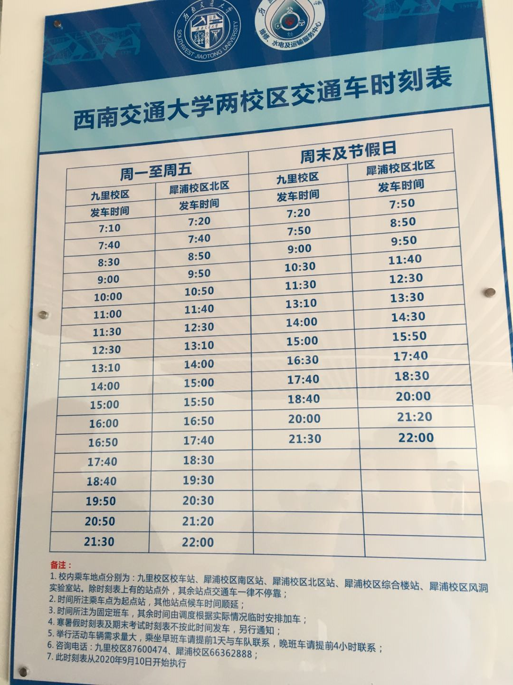
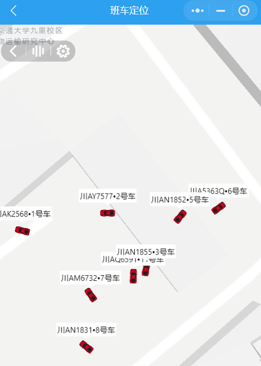

## 西南交通大学：九里校区到犀浦校区交通出行

​       我是20级研究生，在九里校区已经住了两个学期，几乎每天往返九里犀浦，目的是分享自己的经验给大家一个参考。

------

### 1、平均行车时间地铁最快

下表是不同的交通方式的行程时间,不包括步行时间。

| 交通工具 | 最短时间 |                 起点<--->终点                 | 费用    |
| :------: | :------: | :-------------------------------------------: | ------- |
|  校车⭐⭐  |  25分钟  |   校车站------犀浦校内(综合楼、南区、北区)    | 2¥      |
|  地铁⭐⭐  |  17分钟  |          西南交大站------兴业北街站           | 4¥      |
| 公交119  |  40分钟  | 西南交大九里校区站---犀安路校园路口站（任意） | 2¥      |
| 共享单车 |  50分钟  |              九里---犀浦（任意）              | 1¥-8¥   |
|   打车   |  25分钟  |             九里---犀浦（校门口）             | 25¥-48¥ |

注：就行车时间而言，地铁最快。校车慢一点，但是费用少一半。公交、单车和打车时间长、费用高不推荐。所以以下只讨论校车和地铁，公交。

### 2、步行时间--校车更方便

| 交通工具 | 步行时间（估计） | 骑单车时间     |
| :------- | ---------------- | -------------- |
| 校车⭐⭐   | 5分钟  +  5分钟  | 基本不需要骑车 |
| 地铁     | 15分钟 + 15分钟  | 5分钟 + 8分钟  |
| 公交     | 5分钟  +  20分钟 | 2分钟 + 12分钟 |

注：很明显校车步行时间最短，而且另一方面单车很重要，如果做到比大部分同学早出门、早回家，就都有共享单车。

### 2、候车时间与班次---地铁更好

| 交通工具 |        候车时间         |                 候车地点                 |
| :------: | :---------------------: | :--------------------------------------: |
|  校车⭐   | 踩点(一分钟内)---20分钟 | 校车站------犀浦校内(综合楼、南区、北区) |
|  地铁⭐⭐  | 踩点(一分钟内)---9分钟  |        西南交大站------兴业北街站        |

校车班次：

现在的时刻表：

上学期的时刻表：

注：地铁是最规律的，不需要等太久。校车的班次未来估计会增加，但是在黄金时段人特别多，排队很长。等个10到20分钟很正常。如果着急就坐地铁了。

最重要的是，校车站会根据坐车的人流量增加班次的。

### 4、舒适度

这方面校车最好，第一是有座位，相对安静很多。可以做很多事情，比如看看书啥的，但是一般情况看看手机一会儿就到了。第二是不要要走太远，学校有好几个候车点。所以我一般晚上10:05在南区校车站踩点上车刚好。

###  5、针对上课情况。

1. 赶第一节课 7点10，7点20的班次，这是首班，一般人比较少，需要7点到达车站，那么起床时间大概是6点半，如果女生，可能要6点起床。
2. 赶第二节课 8点30, 8点50，9点10，的班次，这个点人特别多，需要提前发车时间20分钟。

 

### 6、总结：

我的出行计划：

首选校车：我比较喜欢坐校车，可以看看风景，可以再忙的时候做一些事情(看书啥的)。根据情况我有三个时间点赶车：优先校车，错过了就去地铁站。

① 上第一节课 ：8点上课，坐第一班校车7:10，如果人多会增加一班7:20.

② 上第二节课：9点50上课，坐8:50和9点的校车。一般人特别多。

③ 没课的时候：最迟11点的校车，和12点半的校车。（一般是坐9点的校车去实验室）。

晚上回来一般是10的末班校车或者11点20的末班地铁

### 7、推荐

校车查询：微信小程序“车队管家”

